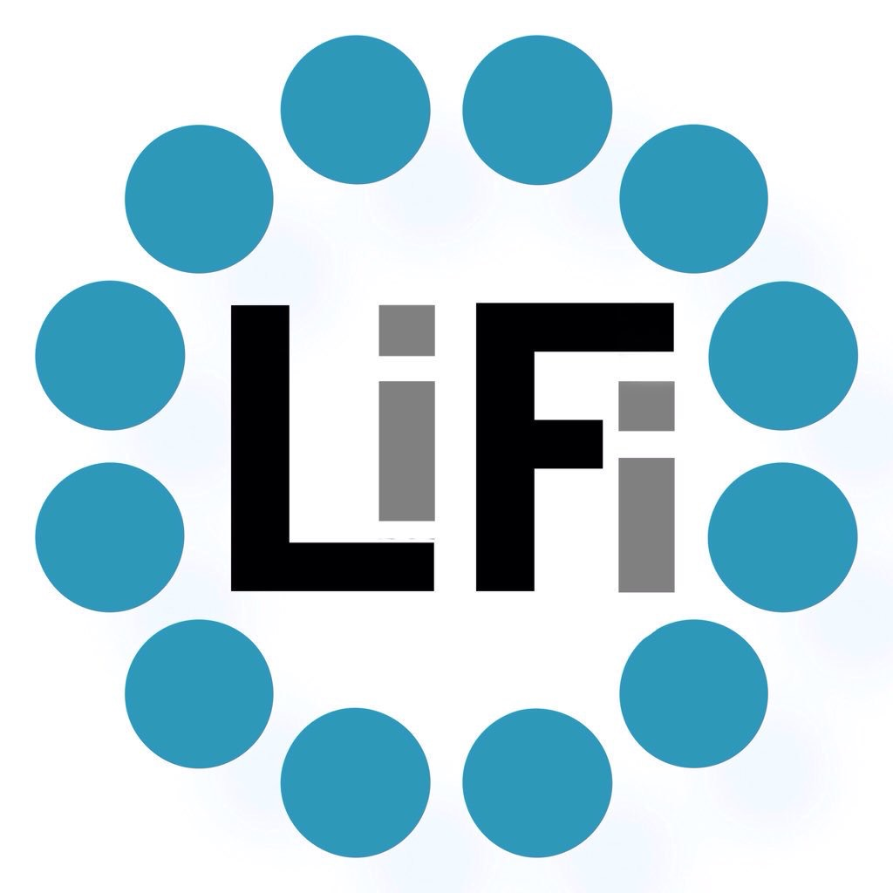
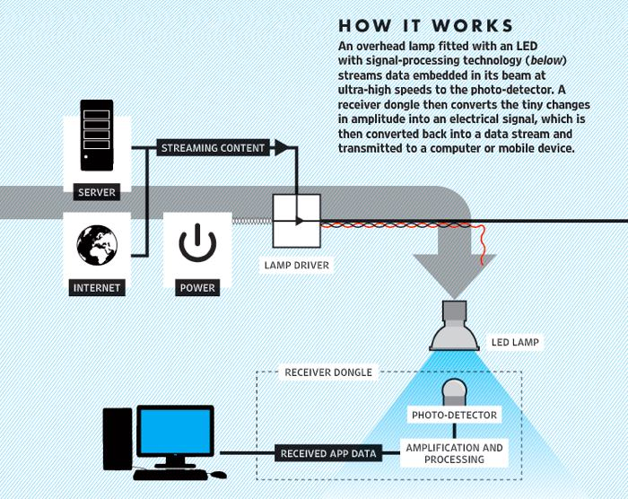

# **LIFI**

## Apa itu LiFI ?
Li-Fi Singkatan dari Light Fidelty adalah teknologi yang mampu mengantar sinyal internet melalu perantaraan cahaya. 
Berbeda dengan WiFi yang menggunakan meidum berupa gelombang radio dengan rentang frekuensi 2.4 GHz atau 5 GHZ.
Selain itu, bandwith cahaya dinilai lebih besar dan sesuai untuk koneksi yang stabil dan simultan dari berbagai perangkat Internet of Things (IoT). Teknologi yang diadopsi oleh LiFi sendiri hampir sama dengan yang diadopsi di WiFi. Keduanya adalah teknologi nirkabel dua arah dengan yang kecepatan transfer data yang tinggi.
Istilah **LiFi** sendri dikemukakan oleh profesor Harald Haas, yang tak lain merupakan seorang akademisi dari University of Edinburgh. Haas sendiri sudah mendemonstrasikan LiFi sejak tahun 2011 dalam forum TEDGlobal di Edinburgh, Jerman.

## Bagaimana cara kerja Li-Fi ? 
 
Cara kerja Li-Fi adalah dengan mentransferkan data elektromagnetik yang berjalan pada gelombang cahaya, yang kemudian menghasilkan sinyal lalu akan diterima oleh pengguna. Sebenarnya cara kerja Li-Fi sama dengan yang dilakukan Wi-Fi, hanya saja jika Wi-Fi menggunakan gelombang radio sedangkan Li-Fi menggunakan gelombang cahaya.

## Bagaimana Keamanan Li-Fi ?
Li-Fi diklaim memiliki keamanan yang lebih baik dari pada Wi-Fi yang saat ini sudah hampir tersedia di seluruh dunia. Alasannya karena Li-Fi menggunakan sebuah bola lampu LED untuk menghantarkan sinyal nya, terlebih sinar bola lampu tidak dapat menembus dinding.
Li-Fi juga memiliki rentang fungsi yang lebih pendek daripada Wi-Fi pada umumnya. Namun, ketidakmampuan untuk melewati dinding atau pemblokir ini juga merupakan manfaat besar Li-Fi karena urusan menjaga keamanan data menjadi sangat sederhana hanya dengan mengurungnya di aliran cahaya.

# Kelebihan dan Kelemahan Li-FI
## Keuntungan Dan Keunggulan Li-Fi
Keuntungan menggunakan Li-Fi ini adalah memudahkan siapa saja untuk mengakses internet dimana pun bahkan di wilayah terpencil sekalipun yang tidak bisa dijangkau oleh kabel optik. Selain itu Li-Fi juga dapat digunakan mengontrol kondisi lalu lintas dengan cara menempatkan teknologi baru ini ke LED mobil.

Fungsi yang sama ternyata juga dapat diterapkan dengan lampu overhead pesawat. Keunggulan lain dari teknologi Li-Fi adalah mampu mengurangi polusi elektromagnetik yang dihasilkan oleh gelombang radio.

## Kelemahan dan Tantangan Li-Fi
Meski memiliki banyak keunggulan teknologi Li-Fi juga masih memiliki beberapa kelemahan dibanding sistem Wi-Fi konvensional. Li-Fi yang diterapkan secara base station pada langit-langit ruangan ini membutuhkan direct line of sight atau “pandangan” langsung ke perangkat tujuan. Direct line ini ternyata juga harus dilengkapi receiver khusus, seperti koneksi infra red pada gadget jadul.

Selain itu, perangkat tujuan ini harus tidak boleh dipindah-pindahkan. Dari perkembangan yang ada, teknologi Li-Fi juga menyimpan banyak tantangan antara lain membutuhkan line-of-sight yang sempurna untuk mengirimkan data. Tantangan berat lainnya yaitu cara mengirimkan kembali data ke pemancar secara optimal.

## Mengapa Li-Fi Begitu Cepat?
LiFi yang memiliki kecepatan berkali kali lipat dibandingkan wifi karena disebabkan oleh jenis LED yang merupakan semikonduktor punya sifat berbeda dari jenis lampu lain. Dengan sifat dan ciri-ciri seperti ini membuat LED mampu untuk beralih on dan off dalam beberapa nanodetik atau miliar detik.
**Nanodetik** Jika di konversikan dalam kecepatan data setara dengan 1 Gbits/s. Maka dari itu saat Wi-Fi hanya bisa mencapai 100 Mbits/s kecepatan data .
Itulah kenapa LiFi memiliki kecepatan 10x lipat dari WiFi.
